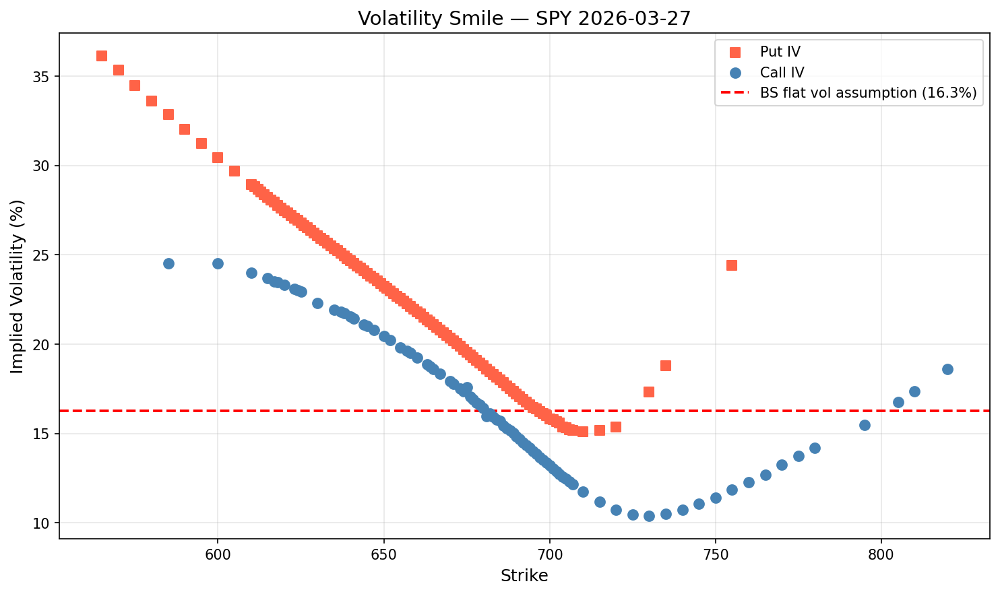
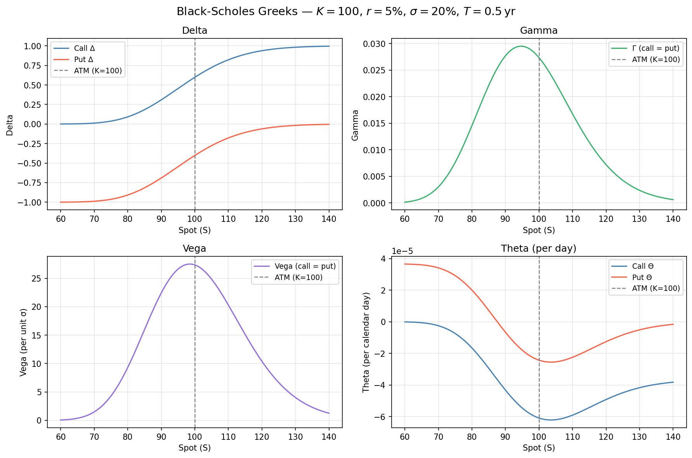
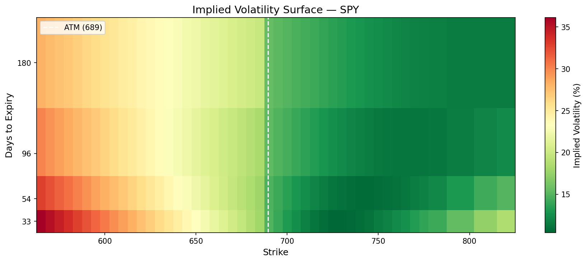

# options-pricing-engine

C++17 Black-Scholes pricing library with analytical Greeks, a vectorised batch pricer, and pybind11 Python bindings. Applied to live SPY options data to extract implied volatility per strike and plot the volatility smile, Greeks profile, and IV surface across expiries.

---

## Performance

Measured on Apple M3, compiled with `-O2`:

```
Contracts priced : 1,000,000
Total time       : 56.15 ms
Throughput       : 17,808,567 contracts/sec
```

---

## Design notes

**Analytical Greeks.** Computed in closed form rather than finite difference. Exact, no truncation error, and shared subexpressions like `norm_pdf(d1)` are cached across gamma and vega.

**C++ core, Python interface.** Pricing lives in a compiled static library. pybind11 exposes it to Python for data fetching, IV solving, and visualisation without touching the hot path.

**IV solver.** Newton-Raphson inverts BS iteratively using vega as the derivative. Illiquid strikes (zero bids, wide spreads, or outside ±20% of spot) are filtered before solving.

---

## Visualisations

### Volatility Smile



*SPY implied volatility across strikes, 30-day expiry. The dashed line is ATM implied vol, what BS assumes is constant across all strikes. The left skew is crash risk priced into OTM puts.*

---

### Greeks Profile



*All four analytical Greeks plotted against spot price (K=100, r=5%, σ=20%, T=0.5yr). Delta and Theta differ between calls and puts; Gamma and Vega are identical. Dashed line marks ATM.*

---

### IV Surface



*Full IV surface across strike and expiry (30/60/90/180 DTE). The dashed white line marks current spot. Generated from live SPY options chain data.*

---

## Quick start

```bash
pip install pybind11 yfinance matplotlib numpy

git clone https://github.com/samrichell-smith/options-pricing-engine
cd options-pricing-engine

cmake -B build -DCMAKE_BUILD_TYPE=Release
cmake --build build

./build/tests/test_pricing                            # call-put parity, delta bounds, vega symmetry
./build/benchmarks/bench                              # throughput benchmark

python python/example.py                              # price a single contract
python python/greeks_viz.py                           # Greeks vs spot (offline)
python python/volatility_smile.py --ticker SPY        # live smile plot
python python/iv_surface.py --ticker SPY              # live IV surface heatmap
```

---

## Sample output

```
Contract : S=100.0, K=105.0, r=0.05, sigma=0.2, T=0.5 yr  [CALL]

Metric            Value  Notes
----------------------------------------------------
Price            4.5817
Delta            0.4612  dV/dS
Gamma            0.0281  d²V/dS²
Vega             0.2808  per 1% vol move
Theta           -0.0211  per calendar day
```

---

## Project structure

```
src/
  black_scholes.cpp     # BS pricing and analytical Greeks
  batch_pricer.cpp      # vectorised batch pricing
  bindings.cpp          # pybind11 Python bindings
tests/
  test_pricing.cpp      # call-put parity, delta bounds, vega symmetry
benchmarks/
  bench.cpp             # throughput benchmark
python/
  example.py            # single contract pricing demo
  implied_vol.py        # Newton-Raphson IV solver
  volatility_smile.py   # live data smile plot (single expiry)
  greeks_viz.py         # analytical Greeks vs spot (offline)
  iv_surface.py         # IV surface heatmap across expiries
```